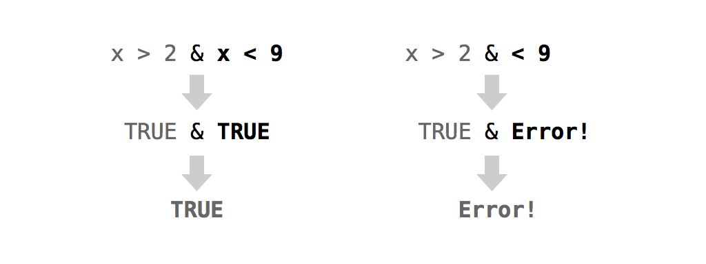

```{r}
#| echo: false
EndSppDF <- read.csv2("EndSppData.csv")
```

# Modifying Values

Are you ready to do some analyses with your endengered species data? Not so fast! The body mass data in your table doesn't align well with different units. 

In this lesson, you will modify the database three times: to Lb, g, and tons. Each of these changes will teach you something different about modifying the values inside of a data set. Start by making a copy of `EndSppDF` that you can manipulate. This will ensure that you always have a pristine copy of `EndSppDF` to fall back on (should things go awry):

```{r}
EndSppDF2 <- EndSppDF
```
### Changing Values in Place

You can use R's notation system to modify values within an R object. First, describe the value (or values) you wish to modify. Then use the assignment operator `<-` to overwrite those values. R will update the selected values _in the original object_. Let's put this into action with a real example:

```{r}
vec <- c(0, 0, 0, 0, 0, 0)
vec
```

Here's how you can select the first value of `vec`:

```{r}
vec[1]
```

And here is how you can modify it:

```{r}
vec[1] <- 1000
vec
```

You can replace multiple values at once as long as the number of new values equals the number of selected values:

```{r}
vec[c(1, 3, 5)] <- c(1, 1, 1)
vec

vec[4:6] <- vec[4:6] + 1
vec
```

You can also create values that do not yet exist in your object. R will expand the object to accommodate the new values: 

```{r}
vec[7] <- 0
vec
```

This provides a great way to add new variables to your data set:

```{r}
EndSppDF2$new <- 1:82

head(EndSppDF2)
```

You can also remove columns from a data frame (and elements from a list) by assigning them the symbol `NULL`:

```{r}
EndSppDF2$new <- NULL

head(EndSppDF2)
```

For the sake of an example, lets say you want to remove the values of the vulnerable species.
If you look into the table you know just where the vulnerable species are, and you can use these locations to describe them with R's notation system:

```{r}
EndSppDF2[c(1, 3, 6, 13, 14, 23, 26, 35, 41, 44, 54, 60, 70, 74, 7), ]
```

You can single out just the `BodyMass` of the vulnerable species. by subsetting the columns dimension of `EndSppDF2`. Or, even better, you can subset the column vector `EndSppDF2$BodyMass`:

```{r}
EndSppDF2[c(1, 3, 6, 13, 14, 23, 26, 35, 41, 44, 54, 60, 70, 74, 7), 4]

EndSppDF2$BodyMass[c(1, 3, 6, 13, 14, 23, 26, 35, 41, 44, 54, 60, 70, 74, 7)]
```

Now all you have to do is assign a new set of values to these old values. The set of new values will have to be the same size as the set of values that you are replacing. So you could save the new values, or you could just save *`NA`* and rely on R's recycling rules to expand `14` to `c(14, 14, 14, 14)`:

```{r}

EndSppDF2$BodyMass[c(1, 3, 6, 13, 14, 23, 26, 35, 41, 44, 54, 60, 70, 74, 7)] <- c(NA, NA, NA, NA, NA, NA, NA, NA, NA, NA, NA, NA, NA, NA, NA)

# or

EndSppDF2$BodyMass[c(1, 3, 6, 13, 14, 23, 26, 35, 41, 44, 54, 60, 70, 74, 7)] <- NA
```

Notice that the values change _in place_. You don't end up with a modified _copy_ of `EndSppDF2`; the new values will appear inside `EndSppDF2`: 

```{r}
head(EndSppDF2, 13)
```

The same technique will work whether you store your data in a vector, matrix, array, list, or data frame. Just describe the values that you want to change with R's notation system, then assign over those values with R's assignment operator.
Things worked very easily in this example because you knew exactly where each ace was.
But what if you don't know. That would be tedious or even impossible if your data frame was large: 

You could ask R to find the Vulnerable species for you? You can do this with logical subsetting. Logical subsetting provides a way to do targeted extraction and modification with R objects, a sort of search-and-destroy mission inside your own data sets. 

### Logical Subsetting

Do you remember R's logical index system. To recap, you can select values with a vector of `TRUE`s and `FALSE`s. The vector must be the same length as the dimension that you wish to subset. R will return every element that matches a TRUE:

```{r}
vec


vec[c(FALSE, FALSE, FALSE, FALSE, TRUE, FALSE, FALSE)]

```

At first glance, this system might seem impractical. Who wants to type out long vectors of TRUEs and FALSEs? No one. But you don't have to. You can let a logical test create a vector of TRUEs and FALSEs for you.

#### Logical Tests

A logical test is a comparison like "is one less than two?", `1 < 2`, or "is three greater than four?", `3 > 4`. R provides seven logical operators that you can use to make comparisons, shown in Table \@ref(tab:logop). 

Table: R's Logical Operators

|Operator|Syntax|Tests
|--------|------|-----
|`>`|`a > b`|Is a greater than b?
|`>=`|`a >= b`|Is a greater than or equal to b?
|`<`|`a < b`|Is a less than b?
|`<=`|`a <= b`|Is a less than or equal to b?
|`==`|`a == b`|Is a equal to b?
|`!=`|`a != b`|Is a not equal to b?
|`%in%`|`a %in% c(a, b, c)`|Is a in the group c(a, b, c)? 

Each operator returns a `TRUE` or a `FALSE`. If you use an operator to compare vectors, R will do element-wise comparisons—just like it does with the arithmetic operators:

```{r}
1 > 2

1 > c(0, 1, 2)

c(1, 2, 3) == c(3, 2, 1)
```

`%in%` is the only operator that does not do normal element-wise execution. `%in%` tests whether the value(s) on the left side are in the vector on the right side. If you provide a vector on the left side, `%in%` will _not_ pair up the values on the left with the values on the right and then do element-wise tests. Instead, `%in%` will independently test whether each value on the left is _somewhere_ in the vector on the right: 

```{r}
1 %in% c(3, 4, 5)

c(1, 2) %in% c(3, 4, 5)

c(1, 2, 3) %in% c(3, 4, 5)

c(1, 2, 3, 4) %in% c(3, 4, 5)
```

Notice that you test for equality with a double equals sign, `==`, and not a single equals sign, `=`, which is another way to write `<-`. It is easy to forget and use `a = b` to test if `a` equals `b`. Unfortunately, you'll be in for a nasty surprise. R won't return a `TRUE` or `FALSE`, because it won't have to: `a` _will_ equal `b`, because you just ran the equivalent of `a <- b`.

::: callout
**`=` is an assignment operator**

Be careful not to confuse `=` with `==`. `=` does the same thing as `<-`: it assigns a value to an object. 
:::

You can compare any two R objects with a logical operator; however, logical operators make the most sense if you compare two objects of the same data type. If you compare objects of different data types, R will use its coercion rules to coerce the objects to the same type before it makes the comparison.

::: callout
**Question** *Extract the `Conservation.status` column of `EndSppDF2` and test whether each value is equal to `Vulnerable`. As a challenge, use R to quickly count how many species are equal to `Vulnerable`.*

You can extract the `Conservation.status` column with R's `$` notation.
Next, you can use the `==` operator to test whether each value is equal to `Vulnerable`.

:::
  

In the following code, R will use its recycling rules to individually compare every value of `EndSppDF2$Conservation.status` to `"Vulnerable"`.
Notice that the quotation marks are important. If you leave them out, R will try to find an object named `Vulnerable` to compare against `EndSppDF2$Conservation.status`:

```{r}
# Rebuild EndSppDF2
EndSppDF2 <- EndSppDF

EndSppDF2$Conservation.status == "Vulnerable"
```

You can use `sum` to quickly count the number of `TRUE`s in the previous vector. Remember that R will coerce logicals to numerics when you do math with them. R will turn `TRUE`s into ones and `FALSE`s into zeroes. As a result, sum will count the number of `TRUE`s:

```{r}
sum(EndSppDF2$Conservation.status == "Vulnerable")
```

You can use this method to spot and then change the relevant species in your table—even if you've shuffled your table. First, build a logical test that identifies the Vulnerable species in your table:

```{r}
EndSppDF2$Conservation.status == "Vulnerable"
```

Then use the test to single out the Vulnerable species BodyMass. Since the test returns a logical vector, you can use it as an index:

```{r}
EndSppDF2$BodyMass[EndSppDF2$Conservation.status == "Vulnerable"]
```

Finally, use assignment to change the Vulnerable species BodyMass. in `EndSppDF2`:

```{r}
EndSppDF2$BodyMass[EndSppDF2$Conservation.status == "Vulnerable"] <- NA

head(EndSppDF2)
```

To summarize, you can use a logical test to select values within an object.

Logical subsetting is a powerful technique because it lets you quickly identify, extract, and modify individual values in your data set. When you work with logical subsetting, you do not need to know _where_ in your data set a value exists. You only need to know how to describe the value with a logical test. 

Logical subsetting is one of the things R does best. In fact, logical subsetting is a key component of vectorized programming, a coding style that lets you write fast and efficient R code.

#### Boolean Operators

Boolean operators are things like _and_ (`&`) and _or_ (`|`). They collapse the results of multiple logical tests into a single `TRUE` or `FALSE`. R has six boolean operators, shown in below:

Table: Boolean operators

|Operator|Syntax|Tests
|--------|------|-----
|`&`|`cond1 & cond2`|Are both `cond1` and `cond2` true?
|`|`|`cond1 | cond2`|Is one or more of `cond1` and `cond2` true?
|`xor`|`xor(cond1, cond2)`|Is exactly one of `cond1` and `cond2` true?
|`!`|`!cond1`|Is `cond1` false? (e.g., `!` flips the results of a logical test)
|`any`|`any(cond1, cond2, cond3, ...)`|Are any of the conditions true?
|`all`|`all(cond1, cond2, cond3, ...)`|Are all of the conditions true?

To use a Boolean operator, place it between two _complete_ logical tests. R will execute each logical test and then use the Boolean operator to combine the results into a single `TRUE` or `FALSE`, Figure \@ref(fig:boolean). 

::: callout
**The most common mistake with Boolean operators**
  
It is easy to forget to put a complete test on either side of a Boolean operator. In English, it is efficient to say "Is _x_ greater than two and less than nine?" But in R, you need to write the equivalent of "Is _x_ greater than two and _is x_ less than nine?" This is shown in Figure \@ref(fig:boolean).
:::

```{r boolean, echo = FALSE, fig.cap = "R will evaluate the expressions on each side of a Boolean operator separately, and then combine the results into a single TRUE or FALSE. If you do not supply a complete test to each side of the operator, R will return an error."}
#| label: fig_view.
#| echo: false
#| out-width: null
#| fig-cap: | 
#|   R will evaluate the expressions on each side of a Boolean operator
#|   separately, and then combine the results into a single TRUE or FALSE.
#|   If you do not supply a complete test to each side of the operator, R will
#|   return an error..

```

When used with vectors, Boolean operators will follow the same element-wise execution as arithmetic and logical operators:

```{r}
a <- c(1, 2, 3)
b <- c(1, 2, 3)
c <- c(1, 2, 4)

a == b

b == c

a == b & b == c
```

Could you use a Boolean operator to locate the Vulnerable species over one tom (1000kg) in your table? Of course you can. You want to test each species to see if it is a Vulnerable spcies _and_ it wigth more thna 1000kg. You can write this test in R with:

```{r}
# Rebuild EndSppDF2
EndSppDF2 <- EndSppDF

EndSppDF2$Conservation.status == "Vulnerable" & EndSppDF2$BodyMass > 1000
```

I'll save the results of this test to its own object. That will make the results easier to work with:

```{r}
HeavyVulnerable <- EndSppDF2$Conservation.status == "Vulnerable" & EndSppDF2$BodyMass > 1000
```

Next, you can use the test as an index to select the value of the Heavy and Vulnerable species. Make sure the test actually selects the correct value: 

```{r}
EndSppDF2[HeavyVulnerable, ]

EndSppDF2$BodyMass[HeavyVulnerable]
## 0
```

Now that you've found the heavy vulneravke species, you can update her value:

```{r}
EndSppDF2$BodyMass[HeavyVulnerable] <- NA

EndSppDF2[HeavyVulnerable,]
```

::: callout
**QUESTION** *If you think you have the hang of logical tests, try converting these sentences into tests written with R code. To help you out, I've defined some R objects after the sentences that you can use to test your answers:*

* Is w positive?
* Is x greater than 10 and less than 20?
* Is object y the word February?
* Is _every_ value in z a day of the week?
:::

### Missing Information

Missing information problems happen frequently in data science. Usually, they are more straightforward: you don't know a value because the measurement was lost, corrupted, or never taken to begin with. R has a way to help you manage these missing values.

The `NA` character is a special symbol in R. It stands for "not available" and can be used as a placeholder for missing information. R will treat NA exactly as you should want missing information treated. For example, what result would you expect if you add 1 to a piece of missing information?

```{r}
1 + NA
```

R will return a second piece of missing information. It would not be correct to say that `1 + NA = 1` because there is a good chance that the missing quantity is not zero. You do not have enough information to determine the result.

What if you tested whether a piece of missing information is equal to 1?

```{r}
NA == 1
## NA
```

Again, your answer would be something like "I do not know if this is equal to one," that is, `NA`. Generally, `NA`s will propagate whenever you use them in an R operation or function. This can save you from making errors based on missing data. 

#### na.rm

Missing values can help you work around holes in your data sets, but they can also create some frustrating problems. Suppose, for example, that you've collected 1,000 pass:[<phrase role="keep-together">observations</phrase>] and wish to take their average with R's `mean` function. If even one of the values is `NA`, your result will be `NA`:

```{r}
c(NA, 1:50)

mean(c(NA, 1:50))
```

Understandably, you may prefer a different behavior. Most R functions come with the optional argument, `na.rm`, which stands for `NA` remove. R will ignore `NA`s when it evaluates a function if you add the argument `na.rm = TRUE`:

```{r}
mean(c(NA, 1:50), na.rm = TRUE)
```

#### is.na

On occasion, you may want to identify the `NA`s in your data set with a logical test, but that too creates a problem. How would you go about it? If something is a missing value, any logical test that uses it will return a missing value, even this test:

```{r}
NA == NA
```

Which means that tests like this won't help you find missing values:

```{r}
c(1, 2, 3, NA) == NA
```

But don't worry too hard; R supplies a special function that can test whether a value is an `NA`. The function is sensibly named `is.na`:

```{r}
is.na(NA)

vec <- c(1, 2, 3, NA)
is.na(vec)
```

### Summary

You can modify values in place inside an R object when you combine R's notation syntax with the assignment operator, `<-`. This lets you update your data and clean your data sets

When you work with large data sets, modifying and retrieving values creates a logistical problem of its own. How can you search through the data to find the values that you want to modify or retrieve? As an R user, you can do this with logical subsetting. Create a logical test with logical and Boolean operators and then use the test as an index in R's bracket notation. R will return the values that you are looking for, even if you do not know where they are.

Retrieving individual values will not be your only concern as an R programmer. You'll also need to retrieve entire data sets themselves; for example, you may call one in a function. [Environments] will teach you how R looks up and saves data sets and other R objects in its environment system. You'll then use this knowledge to fix the `deal` and `shuffle` functions.
